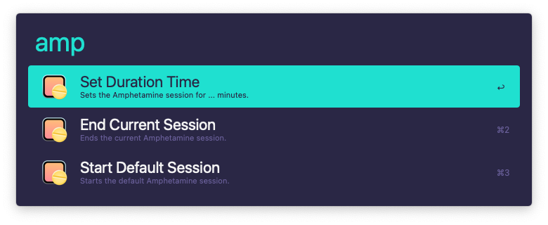

# alfred-amphetamine <!-- omit in toc -->

[![npm package][npm-badge]][npm-link]
[![license MIT][license-badge]][license-link]
[![code style][style-badge]][style-link]

> [Alfred][alfred-link] Workflow for [Amphetamine][amphetamine-link].

<p align="center">
  
</p>

## Table of Contents <!-- omit in toc -->

- [About](#about)
- [Install](#install)
- [Usage](#usage)
- [Related](#related)
- [Contributing](#contributing)
- [Changelog](#changelog)
- [License](#license)

## About

Amphetamine can keep your Mac, and optionally its display(s), awake through a super simple on/off switch, or automatically through easy-to-configure Triggers. Amphetamine is extremely powerful and includes advanced features for those who need them, yet remains intuitive and easy-to-use for those who don't need all of the bells and whistles. -- _[William Gustafson][amphetamine-link]_

## Install

```sh
npm install --global alfred-amphetamine
```

> Requires the Alfred [Powerpack][powerpack-link].

## Usage

Install [Amphetamine][amphetamine-link] from the Mac App Store if you haven't already.

In Alfred, type `amp`, and an option:

| Options      | Description                                    |
| ------------ | ---------------------------------------------- |
| `amp start`  | Starts the default Amphetamine session.        |
| `amp end`    | Ends the current Amphetamine session.          |
| `amp` + `XX` | Sets the Amphetamine session for `XX` minutes. |

## Related

- [alfy][alfy-link] - Create Alfred workflows with ease
- [alfred-updater][alfred-updater-link] - Workflow updater

## Contributing

If you are interested in helping contribute, please take a look at our [contribution guidelines][contributing-link] and open an [issue][issue-link] or [pull request][pull-request-link].

## Changelog

See [CHANGELOG][changelog-link] for a human-readable history of changes.

## License

Distributed under the MIT License. See [LICENSE][license-link] for more information.

[alfred-link]: https://www.alfredapp.com
[alfred-updater-link]: https://github.com/samverschueren/alfred-updater
[alfy-link]: https://github.com/sindresorhus/alfy
[amphetamine-link]: https://apps.apple.com/app/amphetamine/id937984704
[changelog-link]: ./CHANGELOG.md
[contributing-link]: https://github.com/demartini/.github/blob/main/CONTRIBUTING.md
[issue-link]: https://github.com/demartini/alfred-amphetamine/issues
[license-badge]: https://img.shields.io/github/license/demartini/alfred-amphetamine?style=flat-square&labelColor=292a44&color=663399
[license-link]: ./LICENSE
[npm-badge]: https://img.shields.io/npm/v/alfred-amphetamine?style=flat-square&labelColor=292a44&color=663399
[npm-link]: https://www.npmjs.com/package/alfred-amphetamine
[powerpack-link]: https://www.alfredapp.com/powerpack
[pull-request-link]: https://github.com/demartini/alfred-amphetamine/pulls
[style-badge]: https://img.shields.io/badge/code_style-demartini%E2%80%99s-663399.svg?labelColor=292a44&style=flat-square
[style-link]: https://github.com/demartini/base-configs
